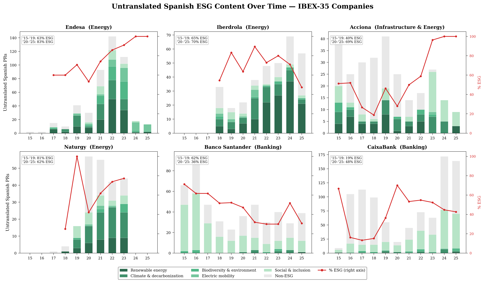

# Draft Topic Modeling Analysis — April 13, 2026

## Current Status

**33 IBEX-35 companies processed.** Corpus: 56,207 docs (21,932 EN + 34,275 ES), ~57M words.
Qwen embeddings (56,207 × 1024) and cross-lingual similarity computed.
Topic modeling completed in both directions (ES→EN and EN→ES).

## Comparison with Funcas Paper 

| | Paper | This study |
|---|---|---|
| Model | BERT (sentence-level) | Qwen3-Embedding-0.6B (document-level) |
| Period | 2013–2023 | 2007–2026 |
| Companies | 30 | 33 (added Amadeus, Mapfre, Unicaja Banco) |
| Corpus | 30,782 PRs | 56,207 PRs |
| Mean EN→ES similarity | 0.928 | 0.889 |
| Mean ES→EN similarity | 0.898 | 0.852 |

Our **new scores** are systematically ~0.04 lower due to document-level (vs sentence-level) comparison and the larger, longer-spanning corpus. The **ranking of companies is preserved** (Spearman ρ=0.60, p<0.001 for ES→EN), confirming the paper's findings with a different methodology.

## Cross-Lingual Similarity Results

- Companies with highest symmetry (both directions >0.9): Fluidra, Iberdrola, Inditex, Logista, Sacyr, Enagás, Ferrovial — these translate nearly everything.

- Companies with largest asymmetry (ES >> EN): CaixaBank (5,039 ES vs 957 EN), Mapfre, Naturgy, Telefónica, Banco Santander — lots of Spanish-only content.

## Topic Modeling: Untranslated Spanish PRs (ES → not in EN)

6,880 untranslated Spanish PRs (bottom 20th percentile of ES→EN similarity), 180 topics across 33 companies.

**Distribution by category:**
- Local events & sponsorships: 30.1% (1,876 docs)
- Corporate operations: 30.0% (1,870 docs)
- **ESG/CSR: 23.6% (1,469 docs)**
- Financial products: 13.9% (864 docs)

**Top ESG themes not translated to English:**
- Renewable energy projects (288 docs, 7 companies: Acciona, Enagás, Endesa, Iberdrola, Mapfre, Red Eléctrica, Repsol)
- University partnerships & education (248 docs: Banco Santander, Unicaja Banco)
- Entrepreneurship programs (139 docs: Banco Santander, CaixaBank, Endesa)
- Social inclusion — gender, disability, senior employment (133 docs: Acciona, Bankinter, Endesa, Indra)
- Electric mobility & EV charging (101 docs: Acciona, Endesa, Iberdrola, Naturgy)
- Climate & decarbonization (69 docs: Enagás, Iberdrola, Naturgy)
- Biodiversity conservation (57 docs: Endesa, Sacyr)

**Companies with highest % ESG in untranslated Spanish content:**
Naturgy (64.4%), Enagás (62.7%), ArcelorMittal (58.3%), Banco Santander (52.5%), Iberdrola (52.4%), ROVI (50.6%), Acciona (49.6%), Endesa (43.0%).

## Topic Modeling: Untranslated English PRs (EN → not in ES)

4,406 untranslated English PRs, 119 topics across 33 companies.

**Distribution by category:**
- Corporate operations: 47.6% (1,984 docs) — subsidiary results, international operations, regulatory filings
- Financial: 21.5% (898 docs) — bond issuances, share buybacks, capital markets
- ESG: 14.6% (608 docs) — global sustainability reporting
- Noise (cookie boilerplate): 10.4% (432 docs)
- Local: 5.9% (248 docs)

## Key Finding: The Asymmetry

| | Spanish-only content | English-only content |
|---|---|---|
| **Dominant theme** | Local + ESG (54%) | Corporate + Financial (69%) |
| **ESG share** | 23.6% | 14.6% |
| **Local share** | 30.1% | 5.9% |
| **Target audience** | Domestic stakeholders | International investors |

**Confirming and extending the Funcas paper:** Spanish-only content is disproportionately local ESG/CSR (_philanthropy, biodiversity, renewable energy, social inclusion, cultural sponsorship_.) 
English-only content is corporate/financial (subsidiary results, securities filings, bond issuances.) 

- Companies communicate their sustainability efforts locally but fail to translate them for international audiences, 
missing an opportunity to build their ESG reputation with international investors and rating agencies.

## Temporal Analysis

I analyzed 6 companies (the ones with the highest ESG contribution) across 2015–2025 for temporal evolution of untranslated ESG content.

**Two distinct patterns emerge:**

### Energy sector (Endesa, Iberdrola, Naturgy):
- Sharp post-2020 spike in untranslated Spanish content
- ESG share of untranslated content increases over time (Endesa: 63% → 83%)
- Dominated by renewable energy, climate/decarbonization, biodiversity
- Aligns with EU Green Deal implementation and Spain's energy transition
- 2021–2022 peak: companies ramped up local ESG communication but didn't scale translation

### Banking sector (Banco Santander, CaixaBank):
- Untranslated volume is structurally high across the whole period (not a post-2020 spike)
- ESG composition dominated by "Social & inclusion" (university programs, entrepreneurship, microcredit)
- CaixaBank shows ESG share growing (19% → 48%) — shifting from local events to ESG
- Banco Santander shows ESG share declining (62% → 36%) — may be translating more social programs

### Acciona (Infrastructure & Energy):
- Untranslated volume decreases over time — actively closing the translation gap
- But ESG share increases (40% → 69%) — the remaining gap is increasingly ESG

**Conclusions:** The ESG communication gap might be sector-dependent? Energy companies face a growing gap driven by Spain's energy transition. Banks have a structural gap around local social programs. Both miss the opportunity to communicate ESG efforts internationally.

***

> [!NOTE]
> **Spain Energy Transition** (Source: Anthropic Claude -- We need to verify this)
>
>The 2021 inflection point in energy companies' untranslated ESG content aligns with a series of regulatory and policy milestones:
>
>- **2020**: Spain's National Energy and Climate Plan (PNIEC) — targets 74% renewable electricity by 2030
>- **2021**: Climate Change Law (Ley 7/2021) — legally binding net-zero by 2050, mandates corporate climate reporting
>- **2021**: EU Taxonomy Regulation takes effect — companies must classify and report "green" activities
>- **2021–2022**: Massive renewable energy auction rounds — ~10 GW of new solar/wind capacity awarded
>- **2022**: Ukraine energy crisis — accelerated domestic renewables push, REPowerEU plan
>- **2023**: EU Corporate Sustainability Reporting Directive (CSRD) begins phasing in
>
> This regulatory push drove energy companies to build solar/wind farms, decommission coal plants, 
> deploy EV charging, and run biodiversity programs. Perhaps this is generating the local 
> Spanish-language PRs aimed at municipalities, regional governments, and local media. 
> International investor relations teams did not scale translation to match.
> 
> **Conclusions based on this observation:** Regulatory-driven ESG activity creates a 
> structural communication asymmetry: the more a company does locally on sustainability, 
> the wider the gap becomes with what international audiences see. 
> 
> Consider the figure below: For each company, we see the weight of EGS topics, and their distribution,
> in the corpus of non-translated Spanish PR (bar chart) over time. The line shows, in percentage, the weight of these
> ESG documents over the total. We observe that energy companies (top row) show a i
> post-2020 ESG increase in untranslated content driven by renewables and climate, 
> while banks (bottom row) have a persistent social inclusion gap. 
> The red % ESG lines make the trend visible.
> 
> 

***
## Output Files Produced

```
results/corpus.json                              # Unified corpus (376 MB)
results/embeddings_qwen.npz                      # Qwen embeddings (56,207 × 1024)
results/similarity_qwen.json                     # Cross-lingual similarity (all 33 companies)
results/topics/topics_untranslated.json           # BERTopic results: untranslated ES PRs
results/topics/topics_untranslated_en.json        # BERTopic results: untranslated EN PRs
results/topics/topics_labeled.json                # Labeled ES topics with ESG classification
results/topics/topics_labeled_en.json             # Labeled EN topics with ESG classification
results/topics/topics_all_companies_es.xlsx        # Excel for external evaluator (ES direction)
results/topics/topics_all_companies_en.xlsx        # Excel for external evaluator (EN direction)
```
